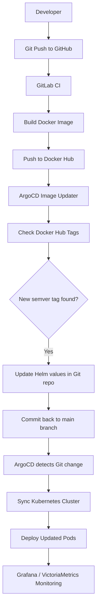

# Task Manager System — Technical Documentation

## Overview

Task Manager is a full-stack web application deployed on a single-node Kubernetes cluster named **Ctesiphon** running Ubuntu 24.04 and Kubernetes v1.35.0. The system follows a GitOps model managed by ArgoCD, with infrastructure-as-code stored in a GitHub repository.

---

## Live System Endpoints

- Frontend: http://task-manager.golden-horde.ir  
- Backend API: http://task-manager-backend.golden-horde.ir  
- Grafana Dashboard: http://grafana.golden-horde.ir  
- ArgoCD UI: http://argocd.golden-horde.ir  

## Architecture

### Application Stack

| Component | Technology | Version |
|-----------|-----------|---------|
| Backend | FastAPI (async) | — |
| Frontend | Next.js (App Router) | 16 |
| Database | PostgreSQL | 18 |
| Cache | Redis | 8.8 |
| ORM / Migrations | SQLAlchemy 2.0, Alembic | — |
| Styling | Tailwind CSS, shadcn/ui | — |

### Infrastructure Stack

| Component | Tool | Notes |
|-----------|------|-------|
| Orchestration | Kubernetes | v1.35.0 |
| GitOps | ArgoCD | app-of-apps pattern |
| Ingress / Routing | Traefik v3 | Gateway API |
| Load Balancer | MetalLB | L2 mode |
| TLS | cert-manager | — |
| Networking CNI | Calico | — |
| Monitoring | VictoriaMetrics Stack + Grafana | — |
| Package Manager | Helm | charts under `charts/` |

---

## End-to-End Delivery Pipeline (GitOps + CI/CD)



---

## Repository Structure

```
ctesiphon-k8s-gitops/
├── bootstrap/
│   └── root-app.yaml
│
├── apps/
│   └── task-manager/
│       └── application.yaml
│
├── charts/
│   └── task-manager/
│       └── templates/
│           ├── backend-deployment.yaml
│           ├── frontend-deployment.yaml
│           ├── postgres-deployment.yaml
│           ├── redis-deployment.yaml
│           ├── httproute-frontend.yaml
│           ├── httproute-backend.yaml
│           └── referencegrant.yaml
│
└── config/
    ├── task-manager/
    │   └── values.yaml
    │
    └── victoria-metrics-k8s-stack/
        └── values.yaml
```

## GitOps Bootstrap

### Root App (bootstrap/root-app.yaml)

An ArgoCD Application named **root** bootstraps the entire cluster by recursively syncing everything under `apps/`:

- Repo: https://github.com/iman244/ctesiphon-k8s-gitops.git  
- Path: apps/ (recursive)  
- Destination: https://kubernetes.default.svc → namespace argocd  
- Sync policy: automated, prune: true, selfHeal: true  

---

### Task Manager App (apps/task-manager/application.yaml)

| Field | Value |
|------|------|
| Name | task-manager |
| Namespace | argocd |
| Sync wave | 3 |
| Chart path | charts/task-manager |
| Values file | ../../config/task-manager/values.yaml |
| Destination namespace | task-manager |
| Sync options | CreateNamespace=true |
| Automated sync | prune + selfHeal |

---

## Kubernetes Deployments

All resources live in namespace `task-manager`. Secrets are read from `task-manager-secrets-external`.

---

### Backend (Deployment)

| Field | Value |
|------|------|
| Image | iman244/task-manager-fastapi:v1.0.1 |
| Replicas | 2 |
| Port | 8000 |
| Strategy | RollingUpdate (maxSurge: 1, maxUnavailable: 0) |
| Graceful shutdown | preStop: sleep 5, terminationGracePeriodSeconds: 30 |
| CPU request/limit | 15m / 150m |
| Memory request/limit | 210Mi / 320Mi |

Environment variables (from secret `task-manager-secrets-external`):

- DATABASE_URL  
- REDIS_URL  
- ALLOWED_ORIGINS: ["http://task-manager.golden-horde.ir"]

Probes (`/health`):

- Readiness: delay 10s, period 5s, timeout 3s  
- Liveness: delay 10s, period 30s, timeout 5s, failureThreshold 3  

---

### Frontend (Deployment)

| Field | Value |
|------|------|
| Image | iman244/task-manager-nextjs:v1.0.4 |
| Replicas | 2 |
| Port | 3000 |
| Strategy | RollingUpdate (maxSurge: 1, maxUnavailable: 0) |
| Graceful shutdown | preStop: sleep 5, terminationGracePeriodSeconds: 30 |
| CPU request/limit | 25m / 150m |
| Memory request/limit | 280Mi / 400Mi |

Environment variables:

- API_URL: http://backend:8000 (internal cluster DNS)

Probes (`/api/health`):

- Readiness: delay 10s, period 5s  
- Liveness: delay 10s, period 30s, timeout 10s, failureThreshold 3  

---

### PostgreSQL (StatefulSet)

| Field | Value |
|------|------|
| Image | postgres:18 |
| Replicas | 2 |
| Port | 5432 |
| Storage | 2Gi PVC, storageClass manual |
| Host path | /kubernetes-volumes/task-manager/postgres |
| PGDATA | /var/lib/postgresql/data/pgdata |
| CPU request/limit | 50m / 200m |
| Memory request/limit | 180Mi / 300Mi |

- Init container creates host path and sets ownership to UID/GID 999:999  
- Credentials injected from `task-manager-secrets-external`  
- Probes: `pg_isready -U postgres`  

Readiness: delay 10s, period 5s  
Liveness: delay 15s, period 30s, timeout 5s, failureThreshold 3  

---

### Redis (Deployment)

| Field | Value |
|------|------|
| Image | redis:8.8 |
| Replicas | 2 |
| Port | 6379 |
| CPU request/limit | 20m / 100m |
| Memory request/limit | 64Mi / 128Mi |

Probes: `redis-cli ping`

Readiness: delay 5s, period 5s  
Liveness: delay 10s, period 30s, timeout 5s, failureThreshold 3  

---

## Networking

### Traefik Gateway

Traefik v3 runs in namespace `traefik`, exposing Gateway `traefik-gateway` (HTTP).

---

### HTTPRoutes

| Route | Hostname | Backend | Port |
|------|---------|--------|------|
| task-manager-frontend | task-manager.golden-horde.ir | frontend | 3000 |
| task-manager-backend | task-manager-backend.golden-horde.ir | backend | 8000 |

Path: `/`

---

### ReferenceGrant

Allows cross-namespace access from `task-manager` namespace to Traefik Gateway.

---

## Containerization

### Backend Dockerfile

- Base: python:3.14-slim  
- Installs curl  
- Installs dependencies  
- Runs as non-root `appuser`  
- HEALTHCHECK: `/health` endpoint  

---

### Frontend Dockerfile

Multi-stage build:

- deps → install dependencies  
- builder → Next.js build  
- runner → minimal runtime  

- Runs as non-root user  
- NODE_ENV=production  
- HEALTHCHECK via `/api/health`  

---

## CI/CD Pipelines

### Backend Pipeline

Stages: lint → test → release

- ruff + mypy  
- pytest with coverage ≥ 90%  
- builds Docker images on GitLab + Docker Hub  

---

### Frontend Pipeline

Stages: lint → test → build → release

- eslint + typecheck  
- Jest tests with coverage  
- Next.js build artifact  
- Docker Hub release  

---
## ArgoCD Image Automation

The system uses **ArgoCD Image Updater** to automatically detect and deploy new Docker image versions from Docker Hub.

This enables a fully automated GitOps workflow where image updates are reflected in Kubernetes deployments without manual intervention.

---

### Components

- ArgoCD Image Updater running in the `argocd` namespace
- Secret: `argocd-image-updater-secret`
- Git write-back enabled (updates Helm values directly in repository)

---

### How it works

1. Image Updater monitors Docker Hub repositories:
   - `iman244/task-manager-fastapi`
   - `iman244/task-manager-nextjs`

2. It checks for new tags matching:
   - Semantic versioning pattern: `vX.Y.Z`

3. When a new version is detected:
   - It updates Helm values in `config/task-manager/values.yaml`
   - Commits the change back to the `main` branch using GitOps write-back

4. ArgoCD detects the Git change and automatically syncs the cluster

---

### Update Strategy

- Strategy: `semver`
- Allowed tags: `regexp:^v[0-9]+\.[0-9]+\.[0-9]+$`
- Scope:
  - Backend image: `backend.image.*`
  - Frontend image: `frontend.image.*`

---

### Benefits

- Fully automated deployment pipeline
- No manual image updates in Kubernetes
- Strong GitOps consistency (Git is single source of truth)
- Controlled rollout via semantic versioning

---

## Monitoring

Deployed via VictoriaMetrics stack:

- vmsingle  
- vmagent  
- vmalert  
- vmalertmanager  
- kube-state-metrics  
- node-exporter  
- Grafana  

Grafana:

- PVC 2Gi  
- URL: http://grafana.golden-horde.ir  

---

## Live Cluster State

Single node: `ctesiphon` (Ubuntu 24.04)

All pods running:

- backend (2 replicas)  
- frontend (2 replicas)  
- postgres (2 replicas)  
- redis (2 replicas)  

---

## DNS Summary

| Service | URL |
|--------|-----|
| Frontend | http://task-manager.golden-horde.ir |
| Backend API | http://task-manager-backend.golden-horde.ir |
| Grafana | http://grafana.golden-horde.ir |

## Local Development

### Prerequisites
- Docker + Docker Compose

### Run the system
```bash
docker compose up -d